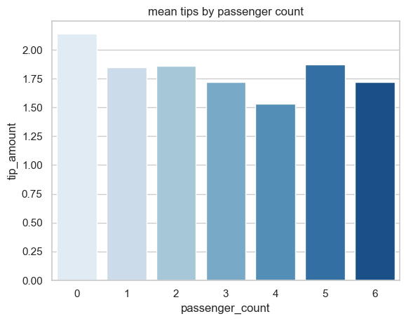

# **Predicting NYC Taxi Ride Duration & Gratuities**
# Overview
`Automatidata`, a data consulting firm, is collaborating with the New York City Taxi and Limousine Commission (TLC) to use their extensive dataset to improve service quality and efficiency in the taxi and limousine industry. The goals in this project are to analyse the TLC data, build a regression model that can predict the `duration of taxi and limousine rides` and finally build a Classification model to determine if a customer `give substantial tips`. The `PACE` framework was used to structure and complete this project. - **P**lan - **A**nalyze - **C**onstruct - **E**xecute.

# Business Understanding
The project tackled the issue of supporting New York City taxi drivers in achieving a `sustainable income` by understanding the aspects that motivate riders to give tips. Although the model can forecast whether a rider will be a generous tipper `give > 20%`, future endeavors might include estimating the specific tip amount or including more data on a rider's tipping track record for a more comprehensive solution.

# Data Understanding
Data used in the project was from the New York City Taxi and Limousine Commission, sourced from NYC.gov, comprising around 22,699 distinct taxi journeys with 18 features, covering trip duration, destination, vendor details, tolls, and payment method. `Exploratory data analysis` revealed insights such as the relationship between features. The Bar plot below shows the relationship between passenger count and tip amount, excluding 0, rides with 5 passengers had the highest average tip amount ($1.87), followed by rides with 2 passengers ($1.86). It was clear that the number of passengers had some influence on the average tip amount, with larger groups tending to leave slightly higher tips.

A `two-sample t-test` was also carried out that revealed there was a `statistically` significant `difference` in the average total fare amount between customers who use credit cards and customers who use cash. Purpose of the A/B test was to find ways to generate more revenue for taxi cab drivers. 

# Modeling and Evaluation
Before building of predictive models, determination of training labels, data standardization, and the division of the dataset into training and test sets were done. Using GridSearch, the best hyperparameters were attained for SVM, Logistic Regression, KNN models and `Classification Trees` which was the top-performing algorithm. The Decision Tree model achieved a best_score of 88.75% after tuning the hyperparameters and performed with `accuracy of 94.44%`, showcasing its reliability in predicting landing outcomes. The bar plot below shows the accuracy score for all the four predictive models tested in this project.

# Conclusion
This project not only predicts Falcon 9 `first stage landings` but also highlights the significant `cost-saving` potential associated with successful landings. SpaceX's competitive advantage in offering cost-effective rocket launches heavily relies on this ability to reuse the first stage. In the future, adding more information like `weather-related` data since weather conditions can significantly influence the outcome of a rocket launch, may contribute to enhanced decision-making and mission success in space exploration efforts.

----
----

# Installation
- Clone this repo to your computer. `git clone` <[repository_url](https://github.com/farahdahir/SpaceX_Falcon9)>
- Navigate to the project directory: using `cd SpaceX_Falcon9`
- Install the required libraries from the `requirements.txt` file using pip: `pip install -r requirements.txt`

# Reviewing the Project
The project follows a storytelling structure and should be reviewed in the following order:
- [data_acquisition](https://github.com/farahdahir/SpaceX_Falcon9/blob/master/data_acquisition.ipynb)
- [eda](https://github.com/farahdahir/SpaceX_Falcon9/blob/master/eda.ipynb)
- [launch_site_analysis](https://github.com/farahdahir/SpaceX_Falcon9/blob/master/launch_site_analysis.ipynb)
- [plotly_dash_app](https://github.com/farahdahir/SpaceX_Falcon9/blob/master/plotly_dash_app.ipynb)
- [predictive_model](https://github.com/farahdahir/SpaceX_Falcon9/blob/master/predictive_model.ipynb)

The project also includes a `presentation` PDF file, an `images` folder and `data` folder. Remember all datasets are generated within the notebooks, so you can choose to clear the data folder (if applicable) by running the following command: `rm -rf data/*`

